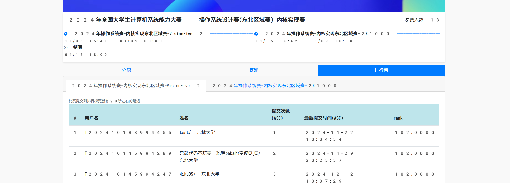

# Baka OS

<a href="https://github.com/caiyih/bakaos">
    
</a>
<a href="https://github.com/caiyih/bakaos">
    
</a>
<a href="https://github.com/caiyih/bakaos">
    
</a>
<a href="https://github.com/caiyih/bakaos/blob/master/LICENSE">
    
</a>
<a href="https://github.com/caiyih/bakaos">
    
</a>
<a href="https://github.com/caiyih/bakaos/activity">
    
</a>
<a href="https://github.com/caiyih/bakaos/activity">
    
</a>
<a href="https://github.com/caiyih/bakaos/graphs/contributors">
    
</a>

<!-- end of line -->

[](https://github.com/caiyih/bakaos/actions/workflows/crates-fmt.yml)
[](https://github.com/caiyih/bakaos/actions/workflows/crates-tests.yml)
[](https://github.com/caiyih/bakaos/actions/workflows/kernel-fmt.yml)
[](https://github.com/caiyih/bakaos/actions/workflows/kernel.yml)
[](https://github.com/caiyih/bakaos/actions/workflows/preliminary.yml)

Baka OS is a UNIX-like asynchronous operating system kernel written in Rust. Targeting RISC-V architecture, it is developed for the 2024 Operating System Kernel Contest(northeastern region).

With the help of stackless coroutine and CPU pool, it has the potential to run thousands of tasks concurrently with multi-core support.

The kernel is separated into multiple crates, and the crates is tested and inspected on the host machine, ensuring high quality code that is easy to maintain and debug.

This kernel does not based on any existing project, and is developed from scratch. With years of OOP experience, this kernel utilized the power of abstraction and encapsulation, resulting a clean and reusable codebase.

The whole project is developed within 3 weeks, with over 400 commits and 12k lines of code. (until the preliminary test submission)

## Documentation

For detailed documentations, please refer to the [`docs`](docs/README.md) directory(Only avaliable in Simplified Chinese).

## Ranking



Up until 2024-12-12, Baka OS is ranked the 2nd in the contest and is the first participant that achieved full score except an test account.

## Continuous Integration

This repository uses continuous integration to keep the code quality high and prevent regressions. Every push is inspected and tested by the CI system, ensuring that the code is always high quality and stable.

| Workflow | Status |
|:---------|:-------|
| Sync to GitLab | [](https://github.com/caiyih/bakaos/actions/workflows/sync.yml) |
| Vendor Dependencies | [](https://github.com/caiyih/bakaos/actions/workflows/vendor.yml) |
| Crates Code Quality | [](https://github.com/caiyih/bakaos/actions/workflows/crates-fmt.yml) |
| Crates Tests | [](https://github.com/caiyih/bakaos/actions/workflows/crates-tests.yml) |
| Kernel Code Quality | [](https://github.com/caiyih/bakaos/actions/workflows/kernel-fmt.yml) |
| Kernel Tests | [](https://github.com/caiyih/bakaos/actions/workflows/kernel.yml) |
| Preliminary Grading | [](https://github.com/caiyih/bakaos/actions/workflows/preliminary.yml) |

## GitLab repository of the contest

- [T202410145994289/oskernel2024-9](https://gitlab.eduxiji.net/T202410145994289/oskernel2024-9)

## GitHub repository

- [caiyih/bakaos](https://github.com/caiyih/bakaos)

The GitHub repository is the real repository where the development happens. The GitLab repository is only used for the contest.

## Repo introduction

**IMPORTANT: For detailed documentations, please refer to the `docs` directory.**

This repository contains mainly three parts, `kernel`, `crates` and `test_preliminary`.

**For preliminary test related information, please refer to the `README.md` from the `tests_preliminary` directory.**

If you are viewing vendored branch from gitlab, there is also a `third_party` directory, which contains some third party code that the kernel depends on. 

This is directory is generated automatically by a iced frog.

You should never modify it manually.

The vendor operation is intended to speed up(and prevent failure) the build process for the contest, so only gitlab contains these branches.

### `kernel`

The `kernel` directory is where the kernel source exists. 

For kernel development, you should open your editor/language server's workspace to `kernel` folder instead of the repo root. Otherwise you may encounter errors like `can't find crate for 'test'`.

There is a `Makefile` in this folder, which contains a set of useful commands to build, run and test the kernel.

#### Commands

##### `build`

This build the kernel with debug symbol and no optimization

```bash
$ make build
```

Equivalent to `cargo build`

##### `strip`

Remove all debug symbol of the built artifact.

```bash
$ make strip
```

##### `run`

Build, strip and then run the kernel in QEMU.

```bash
$ make run
```

##### `debug`

Build the kernel with debug symbol and run it in QEMU with GDB server enabled.

```bash
$ make debug
```

You have to connect use a GDB client or run `make connect` to connect to the GDB server.

Also, vscode debugging is supported. Just open the `kernel` folder in vscode and press `F5`.

##### Publish profile

You can pass publish profile with `MODE` environment variable.

eg:
```bash
make debug MODE=release
make run MODE=debug
```

`debug` is the default profile.

##### Logging

The kernel uses the `log` crate for logging. You can set the `LOG` environment variable to control the log level.

eg:

```bash
$ make run LOG=TRACE
```

This runs the kernel with log level set to `TRACE`.

Please note that the log level is hard coded at compile time. But you don't have to worry as `run` command will rebuild the kernel with the specified log level.

There are 6 log levels in total:
- `ERROR`
- `WARN`
- `INFO`
- `DEBUG`
- `TRACE`
- `OFF`

Level `ERROR` is the highest level, and `TRACE` is the lowest level.

The default log level is `INFO`.

Please note that `OFF` will disable all logging from the `log` crate, but the kernel may still print some messages to the console. But that should not be a thing to worry about.

### `crates`

The `crates` directory contains some code that the kernel directly depends on. These code are implemented in separate crates and can therefore be tested separately even on host machine instead of in the kernel.

All crates are registered in a cargo workspace, so you just have to open your editor/language server in the `crates` folder to edit all crates.

You can run `cargo test --all` in the folder to test all crates.

## License

This project (including the kernel and crates) is licensed under the MIT License. See [LICENSE](LICENSE) for more details.

Some code within this project is derived from other projects and is subject to their respective licenses. The `lib.rs` file of each relevant crate includes the corresponding license information.

Currently, the following crates include code derived from other projects:

- **`path`**: Derived from the [.NET Standard Library](https://github.com/dotnet/runtime), licensed under the MIT License by the .NET Foundation.

- **`TimeSpan` struct in `time`**: Partially derived from the [.NET Standard Library](https://github.com/dotnet/runtime), licensed under the MIT License by the .NET Foundation.

### Important Statement

This project/repository (including any derivative projects or repositories, or any part thereof) **cannot** be used in the [`全国大学生计算机系统能力大赛`](https://os.educg.net) or similar contests without prior written authorization from all contributors. Authorization from specific contributors is not required if their code is not used or referenced.

This restriction applies to all commits in this repository, including those made prior to the inclusion of this statement. For all other use cases, the terms of the MIT License apply as outlined above.

This statement always applies to the most recent version of this project. See `README.md` in [`caiyi/bakaos`](https://github.com/caiyih/bakaos).

#### Additional

For any content explicitly covered by special statements or restrictions in this repository, users are still allowed to use, modify, or redistribute the code **as long as they comply with the terms of the open-source license under which it is provided**. These special statements only restrict specific use cases, such as participation in certain contests, but do not limit other lawful uses permitted by the original license.

##### Unrestricted Components

The following parts of this repository are not restricted and can be freely used under the terms of their respective licenses:

- **TftpServer**: Not restricted. Refer to the header of the code for more details. The Microsoft Public License is applied.
- **Preliminary test visualizer script (`test_preliminary/visualize_result.py`)**: Not restricted. The MIT License is applied.
- **Kernel unwinder script (`kernel/unwinder.py`)**: Not restricted. The MIT License is applied.

## Funky!


