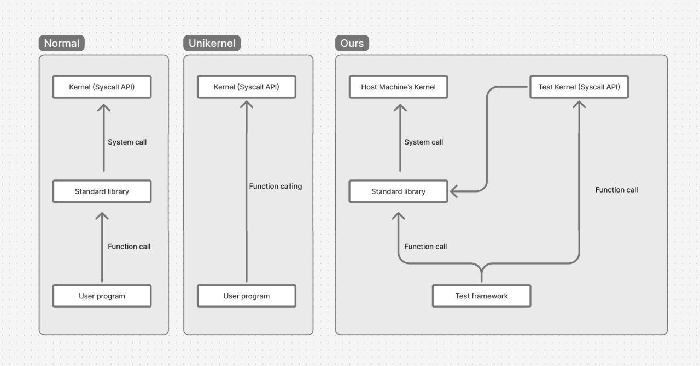

# BakaEx

BakaEx 是我们基于 BakaOS 代码库打造的下一代操作系统内核。本文将从宏观角度介绍 BakaEx 内核的设计与实现。要查看 BakaEx 内核各部分讲解的详细文档，请点击[这里](#详细文档目录)。如果你想查看代码，这里有一些[指引](#代码阅读指引)，请先阅读它们。

## 可测试设计的核心思想

本系统采用了一种模块化和可插拔的架构，使系统调用及其依赖的内核子系统能够在普通的用户态测试中运行。其核心思想包括：

1. 控制反转（Inverse of Control）：明确区分“接口”与“实现”，每个功能模块都被分成纯抽象接口（如内存空间管理器、帧分配器、MMU）和实际实现模块，强制双库实现。
2. 依赖注入（Dependency Injection）：所有关键依赖都通过显式注入传入系统调用上下文，而不是依赖全局状态或硬件寄存器。
3. 模块共用：裸机内核与单元测试在下层使用同一套代码，上层接口分离。通过控制上层接口，我们可以在不启动内核的情况下，测试内核的各个模块。
4. MMU 抽象：内存空间与 MMU 的行为通过软件模拟实现，可自由控制页表映射、权限检查等逻辑，脱离实际平台运行。

其中 1，2，3 是 BakaEx 在架构上能够被测试的核心。而 4 是 BakaEx 在运行时上能够被测试的核心。

这种设计应用了现代软件工程思想，允许系统调用在不启动整个内核的前提下，在普通的 Rust 单元测试中被调用、观察、验证。

## 背景与传统局限

在传统操作系统开发中，内核功能的验证依赖复杂的测试流程。通常需要将整个内核编译成镜像，在虚拟机或真实硬件上启动，并通过用户程序或脚本触发系统调用来观察行为。这种流程存在几个关键缺陷：

- 编译与部署耗时，开发反馈周期长。
- 调试困难，常需借助串口、GDB 或远程调试。
- 测试行为不确定，容易受系统状态干扰。
- 与现代开发工具链（如 IDE、断点调试器）难以集成。

这使得内核开发变得高门槛、高成本，尤其在测试涉及内存管理、系统调用、权限控制等底层机制时尤为困难。

## 可测试的 BakaEx 内核

BakaEx 内核被划分为多个 crate（Rust 项目），并在宿主机上对各个 crate 进行了测试和检查，保证了代码的高质量、易维护和易调试。我们的设计思想是“**逻辑上微内核，物理上宏内核**”。

结合了**微内核架构设计理念**、**测试驱动开发（TDD）思想**和**宏内核性能优势**的现代操作系统内核设计方案，具有以下优秀特性：

- **系统性强**：有完整的开发、测试、验证闭环
- **实践导向**：解决了真实开发流程中的效率问题
- **长期扩展性好**：可以无缝接入 formal verification、cross-architecture 测试
- **符合工业级代码质量控制**：Mock + 宿主机测试让内核代码可以做到模块独立、高可测、易回归
- **平台独立性与开发体验提升**：可以在任意支持 Rust 的系统上开发与测试，包括 Windows、Linux、macOS，不需要 QEMU 模拟器。
- **解耦与可插拔架构**：开发者可以对系统组件进行自由组合，可以进行替换或删减以满足特殊需求。
- **并行化测试**：可以使用 `cargo test` 进行并行化测试，大大提升测试效率。
- **低入门门槛**: 整个内核的开发过程趋近于普通应用开发，普通开发者也能为内核做出贡献，也适用学校教学目的。
- **兼容 Unikernel 模式**：内核设计可以看作是 Unikernel 的超集。

通过构建高度模块化、平台无关且可在用户态直接测试的内核系统，本设计突破了传统内核开发的局限。它不仅提升了开发效率与调试体验，也为更高质量、更可维护的系统软件开发奠定了基础。该方法特别适合用于教学、研究和新内核原型开发场景，并具备良好的扩展性与工业化前景。

下面我们将逐何进行一介绍 BakaEx 内核的模块化设计，并介绍如测试。

## 完整的测试覆盖能力

以匿名内存映射（sys_mmap）系统调用为例，该系统设计允许如下功能被测试：

- 参数校验，如地址对齐检查、长度上限、偏移对齐。
- 地址选择策略验证，包括用户指定地址、自动选择地址、处理映射冲突。
- 权限处理，验证可读、可写、可执行权限是否生效。
- 映射后行为，通过模拟 MMU 读取映射区的内存，确认映射确实建立且行为正确。
- 错误路径与边界条件，如无效参数、地址不可用、权限冲突等情况。

这些测试能够在普通的 Windows 系统上完成，无需虚拟机、WSL 或特殊硬件。测试使用标准的 `#[test]` 机制，通过断言确认系统行为，具有高度的可重复性与稳定性。

下图展示了我们内核的可测试性原理：

## 解耦与可插拔架构

系统中的每一个依赖组件都是通过 trait 抽象定义，并在测试或运行时进行绑定。这种架构具有以下特性：

- 测试时可以使用内存中模拟实现，如测试用帧分配器、测试用 MMU，实现快速初始化与清理。
- 实际运行时可以替换为真实的物理内存管理器、页表操作逻辑，复用同一套系统调用代码。
- 各模块之间无硬编码依赖，便于独立测试、重构或替换某一部分实现。

## 平台独立性与开发体验提升

该设计的一大优势是其平台独立性。由于所有关键逻辑均可在用户态运行，并不依赖内核态特权或特定硬件特性，因此：

- 可以在任意支持 Rust 的系统上开发与测试，包括 Windows、Linux、macOS。
- 开发者可以使用熟悉的 IDE 进行调试、断点跟踪、快速运行测试用例。
- 所有系统调用都可以作为普通函数被调用、监视和断言其行为。

这使得整个内核的开发过程趋近于普通应用开发，极大地降低了门槛，提高了效率。

## 易于集成与持续测试

由于系统调用和相关逻辑完全在用户态中被测试，所有测试用例都可以直接纳入 CI 流水线，无需额外部署虚拟机或启动环境。这种架构特别适合：

- 教学场景：学生可以独立实现并验证系统调用行为，无需配置复杂的环境。
- 实验性内核：无需提前构建完整镜像，也能逐步验证新特性。
- 工程项目：实现持续集成测试，及时发现系统级回归错误。

## 对教学与研究的价值

本系统设计为教学与研究带来了前所未有的便利性：

- 学生可以在普通操作系统中学习和实验内核行为，无需复杂的搭建环境。
- 教学案例可将系统调用拆分为最小测试单元，每个系统调用行为可独立验证。
- 研究者可以快速验证新的调度算法、内存分配策略或页表机制，而无需编写完整的内核。

这种设计理念为现代操作系统开发打开了一种新的范式：**将内核作为库，将系统调用作为函数，从而将开发过程彻底融入现代软件工程流程中**。

## 详细文档目录

我们建议按照顺序阅读文档，否则可能会对一些内容感到困惑。

1. [**可测试内核的设计哲学**](./philophy.md)

2. [**可测试内核的依赖注入**](./dependency.md)

3. [**可测试内核的控制反转**](./abstractions.md)

4. [**可测试内核的内存抽象**](./memory.md)

5. [**系统调用的测试驱动开发 —— 以 sys_mmap 为例**](./sys_mmap.md)

6. [**将宿主文件系统带入 BakaEx 中测试**](./filesystem.md)

7. [**BakaEx 的 Unikernel 模式**](./unikernel.md)

8. [**BakaEx 的隔离执行环境**](./container.md)

9. [**当心语义陷阱**](./traps.md)（建议阅读）

## 代码阅读指引

在阅读代码前，我们建议你至少阅读文档的 1 ~ 6 部分，以了解内核的设计理念、依赖注入、抽象解耦、内存抽象和系统调用的测试驱动开发过程。

阅读完这部分文档后，你可以从查看这些部分的代码开始：

### 1. [`BakaEx\kernel`]：裸机内核代码

这是 BakaEx 用于在裸机上启动的内核的代码。这个部分的代码主要是基于硬件抽象层，构建内核依赖，完成中断处理，以及系统调用分发。对于系统调用实现、硬件抽象层实现等其他一切内核使用的代码，均不在此处。

在 `BakaEx\` 目录中提供一个 Makefile，可以构建、启动裸机内核。使用 `make build ARCH=<arch>` 可以构建指定架构的内核，使用 `make run ARCH=<arch>` 可以在 QEMU 中启动内核。其中 `<arch>` 可以是 `riscv64` 或 `loongarch64`。

内核可测试的核心之一在于在于裸机内核与测试平台共享底层的同一套代码，因此越多的代码从内核中搬离出来，测试的覆盖范围就越大。

我们将这部分的代码控制在仅 400 行，占整个项目代码量约 2%，因此它事实上不不包含复杂的内核逻辑，相应的逻辑位于其他库中。

### 2. [`BakaEx\syscalls`]:系统调用及单元测试

这是 BakaEx 系统调用的代码。在这个部分中，我们实现了系统调用的接口，以及系统调用的单元测试。每个系统调用在其单独的模块中实现，例如`sys_write`系统调用在`sys_write.rs`中实现，`sys_mmap`系统调用在`sys_mmap.rs`中实现。

每个系统调用的实现文件中，最上层 `impl SyscallContext` 块中是系统调用的真正实现代码，下部分由 `#[cfg(test)]` 块包裹的代码是系统调用的单元测试代码。

处于在 `BakaEx\syscalls` 目录及其子目录时，你可以使用 `cargo test` 命令运行所有系统调用的单元测试。你也可以使用 `cargo test sys_write` 命令来指定运行 `sys_write` 系统调用的单元测试。IDE 支持时，也可以单独运行、调试某一个系统调用的单元测试，所有系统调用的单元测试均在宿主主机中进行，不会使用模拟器。

### 3. [`BakaEx\test-utilities`]:测试用工具库

这是 BakaEx 测试用工具库的代码。在这个部分中，我们实现了一些测试用的工具，用于模拟真实的环境。这些工具包括：

- `TestKernel`：用于单元测试的轻量内核，仅用于组装依赖，且依赖是可选的，当依赖不存在但测试依赖时，测试会发生失败。

- `TestFrameAllocator`：用于测试的帧分配器，用于分配测试用的物理页帧。我们提供了两种帧分配器，它们的功能是一致的，但内部实现完全不同。

- `TestMMU`：用于测试的 MMU，用于模拟真实的 MMU 行为。

- `TestProcess` 和 `TestTask`： 用于测试的轻量进程和任务，用于模拟真实的进程和任务行为。注意，裸机内核使用的`Process`和`Task`结构也可以用于测试，但是 `TestTask` 更轻量，更便于测试。

- `HostFile`：用于测试的文件系统，允许将宿主主机的文件系统挂载到 BakaEx 中，用于测试文件系统的行为。

### 4. [`BakaEx\*-abstractions`]: 抽象层代码

BakaEx 的各组件要求双库实现，分为抽象库和实现库。其中抽象库只能依赖于其他抽象库，且抽象库不能实现任何业务逻辑。实现库则可以依赖于抽象库，且可以实现业务逻辑。

例如，`BakaEx\mmu-abstractions` 是 MMU 抽象层的抽象库，`BakaEx\mmu-native` 是 MMU 抽象层的实现库。
