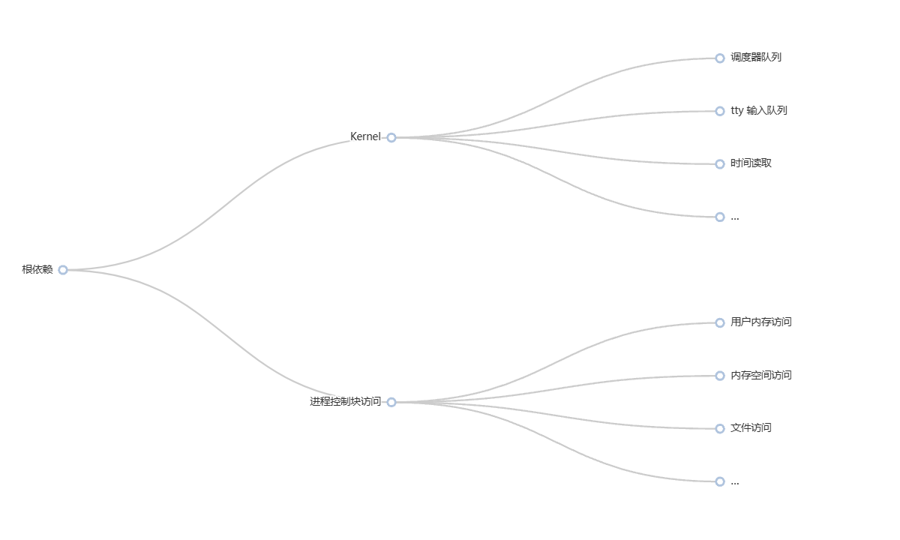

# 依赖注入设计

```cite
依赖注入（dependency injection，缩写为 DI）是一种软件设计模式，也是实现控制反转的其中一种技术。这种模式能让一个对象接收它所依赖的其他对象。“依赖”是指接收方所需的对象。“注入”是指将“依赖”传递给接收方的过程。在“注入”之后，接收方才会调用该“依赖”。此模式确保了任何想要使用给定服务的对象不需要知道如何建立这些服务。取而代之的是，连接收方对象（像是 client）也不知道它存在的外部代码（注入器）提供接收方所需的服务。

注：编程语言层次下，“接收方”为对象和 class，“依赖”为变量。在提供服务的角度下，“接收方”为客户端，“依赖”为服务。

该设计的目的是为了分离关注点，分离接收方和依赖，从而提供松耦合以及代码重用性。

传统编程方式，客户对象自己创建一个服务实例并使用它。这带来的缺点和问题是：

1. 如果使用不同类型的服务对象，就需要修改、重新编译客户类。
2. 客户类需要通过配置来适配服务类及服务类的依赖。如果程序有多个类都使用同一个服务类，这些配置就会变得复杂并分散在程序各处。
3. 难以单元测试。本来需要使用服务类的 mock 或 stub，在这种方式下不太可行。

解决方案：依赖注入可以解决上述问题：

1. 使用接口或抽象基类，来抽象化依赖实现。
2. 依赖在一个服务容器中注册。客户类构造函数被注入服务实例。框架负责创建依赖实例并在没有用户时销毁它。
```

_以上内容来自维基百科[依赖注入](https://zh.wikipedia.org/zh-cn/依赖注入)_

BakaEx 内核全面采用依赖注入的设计思想以实现控制反转（IoC, Inversion of Control），但是不会使用任何依赖注入框架或依赖注入容器，这是因为内核场景的依赖注入较为单一，引入依赖注入框架或依赖注入容器仅仅会让问题变得复杂，而且会影响性能。如果你还没有阅读过 BakaEx 内核的*设计哲学*，请务必先阅读，你可以点击[这里](./philophy.md)查看。

BakaEx 中主要采用 手动+Constructor 的方式进行依赖注入。在用于单元测试场景的 `BakaEx\test-utilities` 中，我们也提供 Fluent creation 风格的 setter 注入方式。

依赖项反转 是构建松散耦合应用程序的关键部分，因为可以编写实现详细信息来依赖和实现更高级别的抽象，而不是以另一种方式实现。因此，生成的应用程序更具可测试性、模块化性和可维护性。通过遵循依赖项反转原则，可以实现依赖注入的做法。[^1]

[^1]: [依赖关系反转](https://learn.microsoft.com/zh-cn/dotnet/architecture/modern-web-apps-azure/architectural-principles#dependency-inversion)

## 系统调用的依赖注入设计

为了进一步分析对系统调用进行单元测试的方法, 我初步将系统调用的依赖分为以下六个大类, 覆盖了系统调用可能涉及的所有资源类型:

1. 进程/线程控制块访问: 需要读取/修改进程控制块的字段, 或创建进程控制块
2. 内核全局状态访问: 需要访问调度器队列, tty 输入队列或输出, 硬件抽象如时间读取等
3. 用户内存访问: 需要读取/修改用户指针, 具体实现可能涉及到通过 PageTable 进行检查
4. 内存空间访问: 需要修改/创建内存空间, 涉及到对页表的修改
5. 文件系统访问: 需要解析路径, 从文件系统树上访问节点 (隐式依赖内核全局状态访问, 因为根节点也属于内核全局状态)
6. 文件访问: 需要通过 file descriptor 访问 dyn IFile 对象, 但不涉及文件系统 (隐式依赖进程控制块, 因为需要获取 fd table)

注意：我们严格区分了**文件访问**与**文件系统访问**的概念，因为它们一个不需要依赖内核全局状态（文件访问），而另一个需要（文件系统访问）。这个概念在后面的内容中也会经常用到，因此请务必注意。

我挑选了一些常用的系统调用进行详细分析:

## sys_write

1. 文件访问: 需要通过 fd 获取 dyn IFile 对象, 且需要向其写入内容
2. 进程/线程控制块访问: 由 1 产生的隐式依赖
3. 用户内存访问: 需要访问用户输入的 buffer

## sys_openat

1. 用户内存访问: 需要访问用户输入的 path
2. 文件系统访问: 需要解析路径获取文件树节点
3. 内核全局状态访问: 由 2 产生的隐式依赖
4. 进程/线程控制块访问: 需要在 fd table 上分配, 同时可能需要获取 cwd

## sys_mmap

1. 内存空间访问: 需要修改用户页表映射情况
2. 进程/线程控制块访问: 由 3 产生的隐式依赖, 需要在进程控制块中记录修改
3. 文件访问: 可能需要通过 file descriptor 访问 dyn IFile 对象

## sys_execve

1. 内存空间访问: 需要重新构建用户空间, 涉及用户页表映射修改
2. 进程/线程控制块访问: 需要修改进程/线程控制块字段
3. 文件系统访问: 需要读取位于磁盘的可执行文件

## 常用系统用的依赖分类

接下来，我们选取了数十个覆盖了 99% 使用场景的系统调用，并对它们的依赖进行了分析，结果如下：

### **1. 基础进程与文件操作**

| 系统调用            | 显式依赖                     | 隐式依赖                       |
| ------------------- | ---------------------------- | ------------------------------ |
| **sys_getcwd**      | 5 (获取当前工作目录路径)     | 1 (需访问进程的 `cwd` 字段)    |
| **sys_dup**         | 6 (复制 `fd` 对应的文件对象) | 1 (修改进程的 `fd table`)      |
| **sys_dup3**        | 6 (同上)                     | 1 (同上)                       |
| **sys_fcntl64**     | 6 (操作文件描述符属性)       | 1 (访问进程的 `fd table`)      |
| **sys_ioctl**       | 6 (设备控制)                 | 2 (可能依赖设备驱动的全局状态) |
| **sys_close**       | 6 (关闭文件对象)             | 1 (释放进程的 `fd table` 条目) |
| **sys_lseek**       | 6 (调整文件偏移)             | -                              |
| **sys_read**        | 3 (用户缓冲区), 6 (文件对象) | 1 (通过 `fd` 获取文件对象)     |
| **sys_write**       | 3 (用户缓冲区), 6 (文件对象) | 1 (同上)                       |
| **sys_readv**       | 3 (多个用户缓冲区), 6        | 1                              |
| **sys_writev**      | 3 (多个用户缓冲区), 6        | 1                              |
| **sys_pread**       | 3, 6 (带偏移读)              | 1                              |
| **sys_pwrite**      | 3, 6 (带偏移写)              | 1                              |
| **sys_pipe2**       | 6 (创建管道文件对象)         | 1 (为两个 `fd` 分配管道对象)   |
| **sys_ftruncate64** | 6 (修改文件大小)             | -                              |

---

### **2. 文件系统与路径操作**

| 系统调用           | 显式依赖                     | 隐式依赖                           |
| ------------------ | ---------------------------- | ---------------------------------- |
| **sys_openat**     | 3 (用户路径), 5 (路径解析)   | 1 (分配 `fd`), 2 (根文件系统状态)  |
| **sys_mkdirat**    | 3 (用户路径), 5 (创建目录)   | 1 (可能需进程权限), 2 (文件系统树) |
| **sys_unlinkat**   | 3 (用户路径), 5 (删除节点)   | 同上                               |
| **sys_symlinkat**  | 3 (目标和链接路径), 5        | 同上                               |
| **sys_linkat**     | 3 (源和目标路径), 5          | 同上                               |
| **sys_umount**     | 5 (卸载文件系统)             | 2 (全局挂载表)                     |
| **sys_mount**      | 3 (参数), 5 (挂载操作)       | 2 (全局挂载表)                     |
| **sys_getdents64** | 3 (用户缓冲区), 6 (目录文件) | 1 (通过 `fd` 获取目录)             |
| **sys_readlinkat** | 3 (用户缓冲区), 5 (解析链接) | 1 (进程权限)                       |
| **sys_newfstatat** | 3 (用户路径), 5 (获取元数据) | 1 (进程权限)                       |
| **sys_newfstat**   | 6 (通过 `fd` 获取元数据)     | 1 (访问 `fd table`)                |
| **sys_chdir**      | 5 (路径解析)                 | 1 (修改进程的 `cwd` 字段)          |
| **sys_renameat2**  | 3 (源/目标路径), 5           | 1 (进程权限), 2 (文件系统锁)       |

---

### **3. 内存与进程管理**

| 系统调用                | 显式依赖                      | 隐式依赖                               |
| ----------------------- | ----------------------------- | -------------------------------------- |
| **sys_brk**             | 4 (调整堆内存边界)            | 1 (修改进程的 `brk` 字段)              |
| **sys_munmap**          | 4 (解除内存映射)              | 1 (更新进程的 VMA 列表)                |
| **sys_mmap**            | 4 (创建映射), 3 (参数)        | 1 (记录映射), 6 (若映射文件)           |
| **sys_mprotect**        | 4 (修改内存保护属性)          | 1 (更新进程的 VMA)                     |
| **sys_clone**           | 1 (创建新任务控制块)          | 4 (复制或共享页表)                     |
| **sys_execve**          | 3 (参数), 4 (重建地址空间), 5 | 1 (替换进程上下文), 6 (加载可执行文件) |
| **sys_exit**            | 1 (销毁当前任务控制块)        | 4 (释放用户空间内存)                   |
| **sys_exit_group**      | 1 (销毁整个进程的任务)        | 同上                                   |
| **sys_wait4**           | 1 (访问子进程状态)            | 2 (调度器队列)                         |
| **sys_set_tid_address** | 1 (设置清理地址)              | -                                      |
| **sys_futex**           | 1 (操作进程的 futex 队列)     | 2 (全局 futex 哈希表)                  |
| **sys_shmget**          | 2 (创建/获取共享内存)         | -                                      |
| **sys_shmat**           | 4 (映射共享内存)              | 1 (修改进程的 VMA)                     |

---

### **4. 时间、系统信息与杂项**

| 系统调用                | 显式依赖                       | 隐式依赖                 |
| ----------------------- | ------------------------------ | ------------------------ |
| **sys_nanosleep**       | 2 (依赖定时器抽象)             | 1 (挂起当前任务)         |
| **sys_sched_yield**     | 2 (主动让出 CPU)               | 1 (更新任务状态)         |
| **sys_times**           | 1 (获取进程时间统计)           | -                        |
| **sys_uname**           | 3 (用户缓冲区)                 | 2 (内核版本信息)         |
| **sys_getrusage**       | 1 (进程资源统计)               | -                        |
| **sys_gettimeofday**    | 2 (系统时钟源)                 | 3 (用户缓冲区)           |
| **sys_getpid**          | 1 (获取当前进程 ID)            | -                        |
| **sys_getppid**         | 1 (获取父进程 ID)              | -                        |
| **sys_getuid**          | 1 (获取用户 ID)                | -                        |
| **sys_geteuid**         | 1 (获取有效用户 ID)            | -                        |
| **sys_gettid**          | 1 (获取线程 ID)                | -                        |
| **sys_sysinfo**         | 3 (用户缓冲区)                 | 2 (全局内存/CPU 状态)    |
| **sys_syslog**          | 3 (用户缓冲区)                 | 2 (内核日志缓冲区)       |
| **sys_ppoll**           | 3 (事件结构体), 6 (文件描述符) | 1 (轮询多个 `fd`)        |
| **sys_pselect6**        | 同上                           | 同上                     |
| **sys_prlimit64**       | 1 (修改进程资源限制)           | -                        |
| **sys_getrandom**       | 3 (用户缓冲区)                 | 2 (熵池状态)             |
| **sys_copy_file_range** | 6 (源/目标文件对象)            | 1 (两个 `fd` 的权限检查) |
| **sys_splice**          | 6 (两个文件对象)               | 1 (同上)                 |
| **sys_statx**           | 3 (用户路径/缓冲区), 5         | 1 (进程权限)             |
| **sys_clock_gettime**   | 2 (时钟源抽象)                 | 3 (用户缓冲区)           |

## 总结

对大量系统调用进行分析后，我们可以得出结论：

1. 我们对依赖分类的六个大类, 覆盖了系统调用可能涉及的所有资源类型
2. 我们可以进步一简化这个分类标准，消除所有的隐式依赖，将其转化成更准确的树形结构

树形结构如下：



我们可以看到，根的子节点只有 _Kernel_ 和 _线程控制块_（由于 _线程_ 才是 CPU 调度的直接单位，因此直接依赖是线程控制块，访问 _进程控制块_ 需要通过 _线程控制块_ ）。这也就是我们的 `SyscallContext` 具有的两个字段分别为 `kernel` 和 `task` 的原因。
